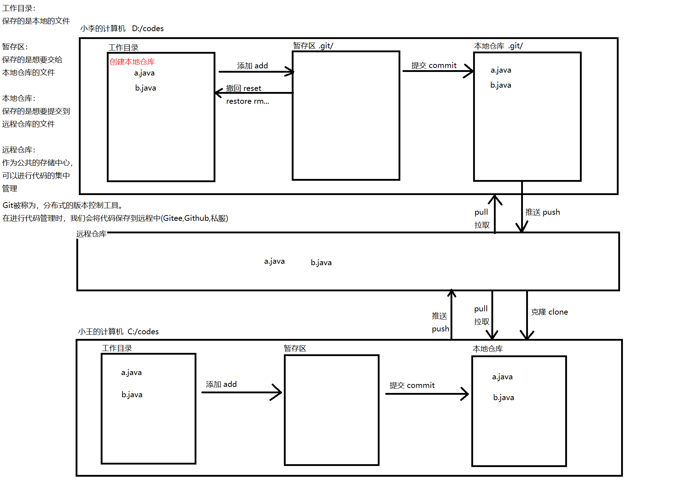

# Git笔记(这里是用的gitee)

## 安装Git

* 闭着眼睛一路下一步


## 测试是否安装成功

1. 打开任意黑窗口
   * cmd 输入 `git --version`
     * 查看版本号
2. 任意路径下右键，选择 `Git Bash Here` ，打开命令行窗口
   * cmd 输入 `git --version`
     * 查看版本号


## Git工作流程




## 一. 基本命令

> Git会忠实的将任何人、什么时间、操作(增删改)了什么文件，记录下来

### 1. 设置全局的用户名称和邮箱地址 `了解`

```sh
# 设置全局用户名
git config --global user.name "用户名"

# 设置全局邮箱地址
git config --global user.email "邮箱地址"

# 查看配置信息
git config --list
```


### 2. 创建本地仓库

> 当执行完成创建本地仓库的命令后，会在当前文件夹中多出一个隐藏目录 `.git` ，这就是我们的本地仓库

```sh
git init
```


### 3. 查看文件状态

> 根据文件的不同状态，需要进行不同的操作来管理，最终目的就是将文件(暂存)提交到本地仓库进行管理
>
> 文件状态：未跟踪、已暂存、已提交、已修改、已删除...
>
> 文件的状态按照颜色来划分：红色、绿色
>
> 红色代表：没有交给git管理的文件
>
> 绿色代表：该文件已经被添加到暂存区，等待执行commit操作，提交到本地仓库

```sh
git status
```


### 4. 添加到暂存区

> 由红色转为绿色的过程(文件状态)

```sh
# 添加单个文件到暂存区
git add 文件名称

# 批量添加到暂存区
git add .
```


### 5. 从暂存区中撤回文件

> 由绿色转为红色的过程(文件状态)

 ```sh
 git rm --cached 文件名称
 ```


### 6. 提交操作

```sh
# 将暂存区的文件提交到本地仓库
# 提交完成后，暂存区就被清空了
git commit -m "日志信息"
```


### 7. 版本切换/版本控制

> 当前提交的操作中，可以自由的穿梭
>
> 当版本发生变化时，我们的文件中的内容也会发生变化

```sh
git reset --hard 版本唯一标识
```


### 8. 查看日志信息

```sh
# 查看本地日志信息
git log

# 简洁的方式查看本地日志信息
git log --oneline 

# 查看历史日志信息
git reflog
```


### 9. 文件内容比较

```sh
# 本地仓库和工作目录的文件内容比较
git diff 文件名称

# 指定版本的文件比较
git diff 版本唯一标识 文件名称
```


### 10. 查看提交的文件内容

```sh
# 查看提交的唯一标识中的文件内容
git ls-tree 版本唯一标识

# 查看文件对象的内容
git cat-file blob 版本唯一标识
```


## 二. 分支命令

> 多条线同时推进，加快开发的节奏
>
> 什么时候创建的master默认分支？第一次提交的时候

### 1. 创建分支

```sh
# 创建出的新的分支，和当前分支代码是一样的
git branch 分支名称
```


### 2. 查看本地分支列表

```sh
# 将本地所有的分支列出来
git branch
```


### 3. 切换分支

```sh
# 切换分支
git checkout 分支名称
```


### 4. 创建并切换分支

> 当前命令 = 创建分支 + 切换分支

```sh
git checkout -b 分支名称
```


### 5. 删除分支

> 不能在当前分支下删除当前分支

```sh
# 普通删除，创建出的分支，并没有修改代码
git branch -d 分支名称

# 强制删除
git branch -D 分支名称
```


### 6. 合并分支

> 将两个分支的代码合并到一处

 ```sh
 # 将目标分支名称，合并到当前分支中
 git merge 目标分支名称
 ```


### 7. 冲突的产生原因及解决

> 需要注意的是如果两个不同的分支，修改了同一个文件的相邻的内容，就会产生冲突问题
>
> Git就懵逼了，不知道以哪个为主了，需要我们手动进行解决这个重复来修复
>
> 不止在合并分支时，会产生冲突，在推送代码的时候也需要注意(先拉取，再推送)，也会产生冲突

* 冲突的文件内容

```sh
123								共有的部分
<<<<<<< HEAD					当前分支部分内容
123
123
=======
qwer
qwer
>>>>>>> aaa						aaa分支部分的内容
```

* 手动解决冲突问题

> 清除标记 `<<<<<<< HEAD` `=======` `>>>>>>> aaa	`

```sh
123
123
123
qwer
qwer
```

* 执行add操作，再执行commit操作，这个分支冲突问题就解决了


## 三. 远程命令

### 0. 当前远程仓库唯一地址

* https://gitee.com/lmx1989/sz2206.git
  * 当前仓库你们没有推送代码的权限，只有拉取和克隆的操作权限

### 1. 选择远程仓库

* [Gitee](https://gitee.com)
  * 服务器在国内
  * 网络稳定
* [Github](https://github.com)
  * 服务器在国外
  * 网络不稳定


### 2. 注册远程账号

> 选择远程账号进行注册


### 3. 关联本地仓库和远程仓库

> 可以关联多个远程仓库，Duck不必！

```sh
# 关联当前本地仓库和远程仓库的关系
git remote add key value(远程仓库地址)

git remote add origin https://gitee.com/lmx1989/sz2206.git
```


### 4. 查看关联的远程关联关系

```sh
git remote -v
```


### 5. 删除关联关系

```sh
git remote remove key
```


### 6. 推送操作

> 将本地仓库的指定分支的代码推送到远程仓库中
>
> 第一操作提交代码时，会弹出一个窗口，输入远程仓库的账号和密码，即可登录成功
>
> 登录的信息会保存到Windows凭证中，如果不小心输入错了，可以清理凭证重新输入即可

```sh
将本地仓库与远程仓库进行连接(两步)
git push -u origin master
git push 远程仓库的key 本地要上传代码的分支名称:远程你要上传的指定分支名称

git push origin aaa

# 问题
# 远程仓库有一个master远程分支，该分支并不是我们的本地仓库创建的
# 本地仓库也有一个master的本地分支，这个分支使我们自己在使用本地仓库时创建的
# 那么问题来了，它们是同一个分支吗？
# 它们不是同一个分支，只是名字相同而已。
# 如果我想要将本地仓库的master代码推送到远程仓库的master
# 直接push或者直接pull都是失败的，需要在pull时，允许合并无关的历史信息
git pull origin master --allow-unrelated-histories
# 将远程的master分支代码更新到了本地
# 更新完成后，就可以向远程仓库推送代码了
git push origin master
```


### 7. 拉取操作

> 将远程仓库的代码拉取到本地仓库中
>
> 1. 拉取本地已有的分支，更新代码
> 2. 拉取本地没有的分支，将远程仓库的分支拉取下来到本地中

```sh
# 拉取本地已有的分支，更新代码
git pull 远程仓库key 远程分支

# 拉取本地没有的分支，将远程仓库的分支拉取下来到本地中
git pull 远程仓库key 远程分支:本地分支
```


### 8. 删除远程分支

> 远程仓库除了默认分支，其他都可以删除掉

```sh
git push -d 远程仓库key 远程分支名称
```


### 9. 克隆操作

> 可以克隆默认分支和指定分支
>
> 克隆下来的代码，会自带本地仓库和远程仓库的关联关系

```sh
# 克隆默认的仓库到本地
git clone 远程仓库的地址

# 指定远程分支克隆
git clone -b 远程分支名称 远程仓库的地址

git clone https://gitee.com/lmx1989/sz2206.git
```

